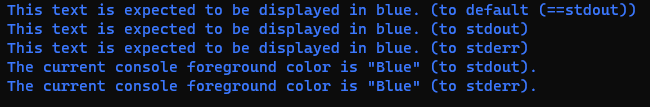
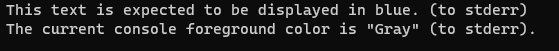

# Experiment.ConsoleStandatdErrorWithColor
This is a project to investigate an issue where stderr output to the console is not colored.

## [Overview]
In a c# console application, if the standard output is redirected, the standard error output is not displayed in the specified color.

## [Execution environment]

+ OS: WIndows 10
+ IDE: Microsoft Visual Studio Community 2022 (64 bit) - Current Version 17.5.1
+ Runtime: .NET6.0.14 / .NET7.0.3
+ Console: Command prompt / Command prompt by Windows terminal

## [Problems that occur and the conditions under which they occur]
1. It is a console application running on `.NET`, and
2. the foreground color has been changed with `Console.ForegroundColor`, and
3. the display has been made to the console by `Console.Error.Write()` / `Console.Error.Write()` case.

If the above conditions are met, regardless of what value the user code sets the `ForegroundColor` property to, the following will occur:
+ The value of the `ForegroundColor` property is `ConsoleColor.Gray`.
+ Characters are displayed in the default foreground color in the console.

## [Reproducibility]
It will definitely reproduce.

## [Sample program]

### Sample source code
Below is the sample source code.

```c#
using System;

namespace Experiment.ConsoleStandatdErrorWithColor.Experiment01
{
    /// <summary>
    /// A test program to check the strange behavior of the Console class.
    /// </summary>
    internal class Program
    {
        private static void Main(string[] args)
        {
            // Back up the current foreground color before changing the foreground color.
            var defaultColor = Console.ForegroundColor;

            // Change the foreground color to blue.
            Console.ForegroundColor = ConsoleColor.Blue;

            // Display with "Console.WriteLine(string?)".
            Console.WriteLine("This text is expected to be displayed in blue. (to default (==stdout))");

            // Display with "Console.Out.WriteLine(string?)"
            Console.Out.WriteLine("This text is expected to be displayed in blue. (to stdout)");

            // Display with "Console.Error.WriteLine(string?)"
            Console.Error.WriteLine("This text is expected to be displayed in blue. (to stderr)");

            // Display the foreground color of the console.
            Console.WriteLine($"The current console foreground color is \"{Console.ForegroundColor}\" (to stdout).");
            Console.Error.WriteLine($"The current console foreground color is \"{Console.ForegroundColor}\" (to stderr).");

            // Restore the foreground color.
            Console.ForegroundColor = defaultColor;
        }
    }
}
```

The complete source code of the sample program can be found at the URL below.
[https://github.com/rougemeilland/Experiment.ConsoleStandatdErrorWithColor/tree/main/Experiment.ConsoleStandatdErrorWithColor.Experiment01](https://github.com/rougemeilland/Experiment.ConsoleStandatdErrorWithColor/tree/main/Experiment.ConsoleStandatdErrorWithColor.Experiment01)

### How to use the sample program
1. Build the above source files to create `experiment01.exe`.
1. The following results are displayed when `experiment01.exe` is executed on the console. 
1. The following results are displayed when `experiment01.exe > foo.txt` is executed on the console. 
1. The following results are displayed when `experiment01.exe 2> foo.txt` is executed on the console. 

## [Investigation result]

According to Mark Lakata's comments on
[a stack overflow post](https://stackoverflow.com/questions/10532796/setting-the-color-for-console-error-writes)
, the issue seems to have existed since at least December 2012.

### `.NET` code findings

First, I examined
[the source code of the `Console` class](https://github.com/dotnet/runtime/blob/main/src/libraries/System.Console/src/System/Console.cs)
, and found that 
[the `ConsolePal` class](https://github.com/dotnet/runtime/blob/main/src/libraries/System.Console/src/System/ConsolePal.Windows.cs)
is responsible for processing the ForegroundColor property.

After that, as a result of investigating the source code of the `ForegroundColor` property of 
[the `ConsolePal` class](https://github.com/dotnet/runtime/blob/main/src/libraries/System.Console/src/System/ConsolePal.Windows.cs)
, the following was found.

* The `ForegoundColor` property getter determines the foreground color from the results of the `GetConsoleScreenBufferInfo` Win32 API.
* A call to the `GetConsoleScreenBufferInfo` API will fail if the handle (that is, any of stdin/stdout/stderr) has been redirected.
* The getter calls the `GetConsoleScreenBufferInfo` API in the following order, and determines the current foreground color based on the information that was successfully obtained first.
  1. A call to the `GetConsoleScreenBufferInfo` API for the handle to standard output
  1. A call to the `GetConsoleScreenBufferInfo` API for the handle to standard error output
  1. A call to the `GetConsoleScreenBufferInfo` API for the handle to standard input
* The `ForegoundColor` property setter sets the specified foreground color to the console by calling the `SetConsoleTextAttribute` Win32 API on standard output. Even if an error occurs in the Win32 API at this time, it will be ignored.
* If the stdout/stderr handle given to the `SetConsoleTextAttribute` Win32 API is a redirected one, the API will return with an error.

### Speculation as to the cause of the problem
From the above survey results, the following can be inferred.

#### 1. If standard output is not redirected.
When user code changes the value of the `ForegroundColor` property, a Win32 API is called as the change to the standard output handle.
After that, when user code prints to standard output, it will be displayed in the console with the foreground color set by the `ForegroundColor` property.
This is expected behavior.

At the same time, the foreground color of the standard error output will also be the same color.
The output destination for standard output is a device called "console", and the output destination for standard error output is the same device, so this is probably expected behavior.

#### 2. If standard output is redirected
When user code changes the value of the `ForegroundColor` property, a Win32 API is called for the change to the standard output handle.
However, **this Win32 API should have failed** because standard output has been redirected, but the failure is ignored.

Subsequent attempts to print characters to stderr will call the Win32 API to ask for information such as the console foreground color.
By the way, standard output is redirected at this time, so it's the Win32 API calls to standard error that correctly return console information.
However, the Win32 API returns the foreground color before the change (that is, the default foreground color) because the foreground color has failed to be changed as described above.

As a result, the foreground color of the standard error output is the default color, regardless of what the ForegroundColor property is set to.
**Of course, this is behavior most users would not expect.**

### About the `BackgroundColor` property
Since the `ForegroundColor` and `BackgroundColor` properties have very similar implementations, they probably have similar potential problems.
Also, it seems that it can be dealt with by the same coping method.

## [About proposed solutions]
The current implementation of the `ConsolePal` class `ForegroundColor` property setter does not error check[^1] calls to the `SetConsoleTextAttribute` Win32 API and only calls to standard output.

Would calling the `SetConsoleTextAttribute` Win32 API on the setter of the `ForegroundColor` property not only on stdout, but also on stderr (and stdin) solve the problem?

The current code is below.
```c#
Interop.Kernel32.SetConsoleTextAttribute(OutputHandle, attrs);
```

My suggested code is below.
```c#
Interop.Kernel32.SetConsoleTextAttribute(OutputHandle, attrs);
Interop.Kernel32.SetConsoleTextAttribute(ErrorHandle, attrs);
Interop.Kernel32.SetConsoleTextAttribute(InputHandle, attrs);
```

However, I don't know why the code was written where the `SetConsoleTextAttribute` API is called only on the stdout handle, so my suggestion may be inaccurate.

At the very least, ignoring the error and calling the `SetConsoleTextAttribute` Win32 API on both stdout and stderr seems to set the foreground color correctly even if one of them is redirected.[^2]

[^1]: Considering that an error occurs even in the common situation that "standard output is redirected", it seems rather natural that error checking is not performed.

[^2]: If the `SetConsoleTextAttribute` Win32 API fails for both standard output and standard error, it should mean that both standard output and standard error are being redirected. Considering whether you really need to care about the value of the `ForegroundColor` property in that situation, you may not need to call the `SetConsoleTextAttribute` Win32 API on standard input.

